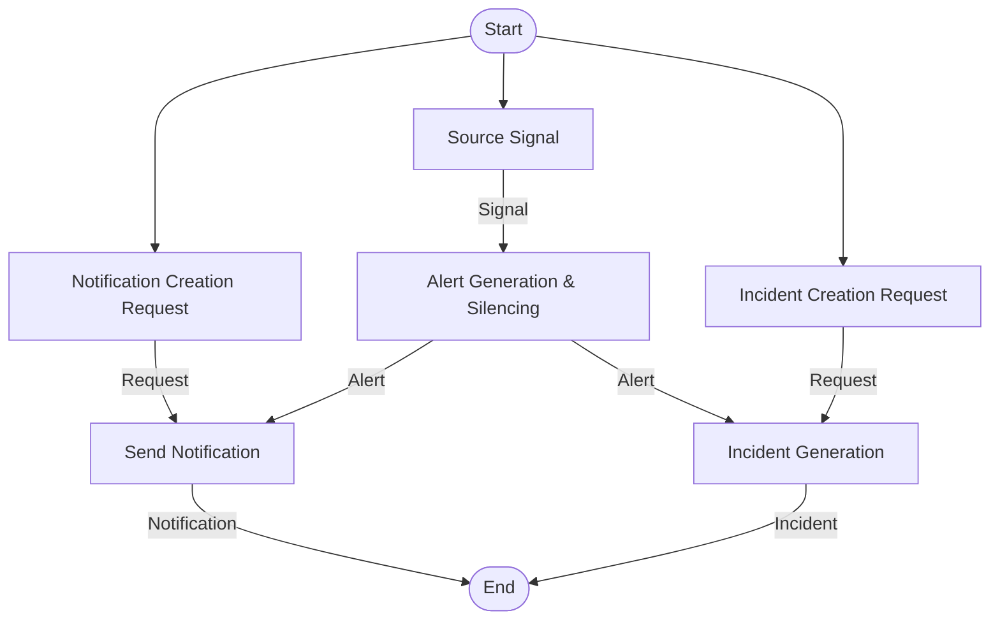
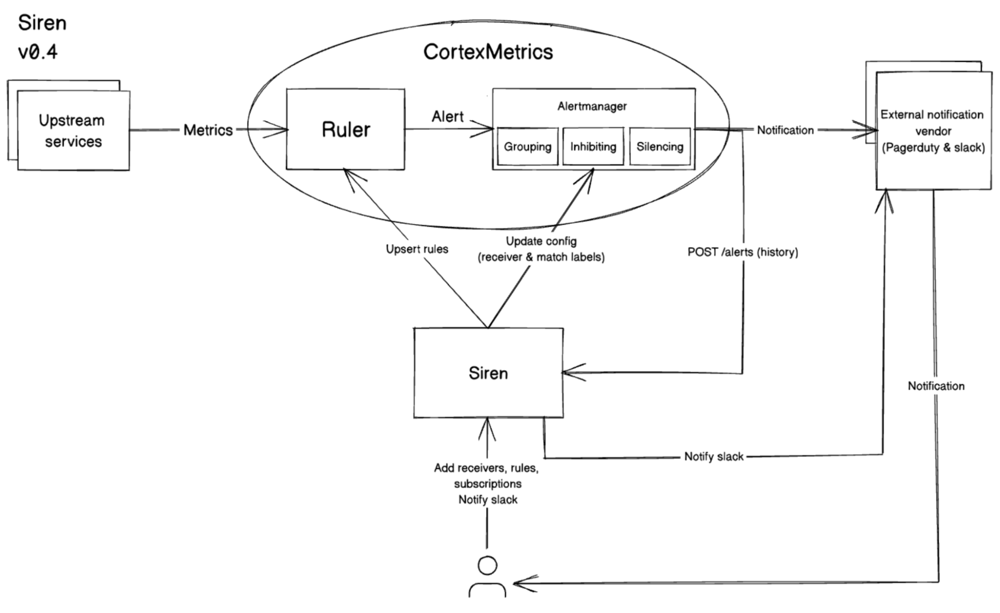
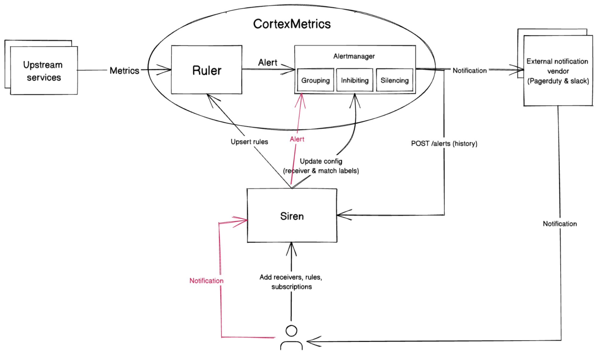
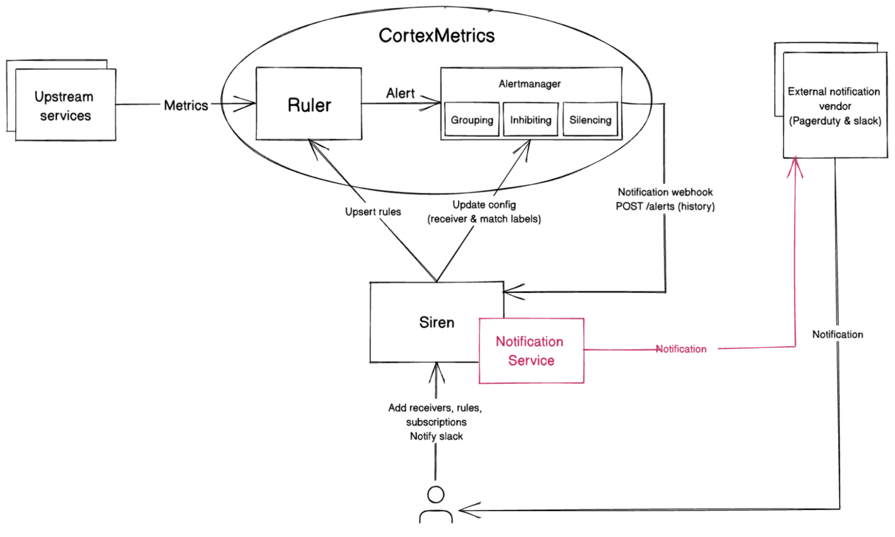
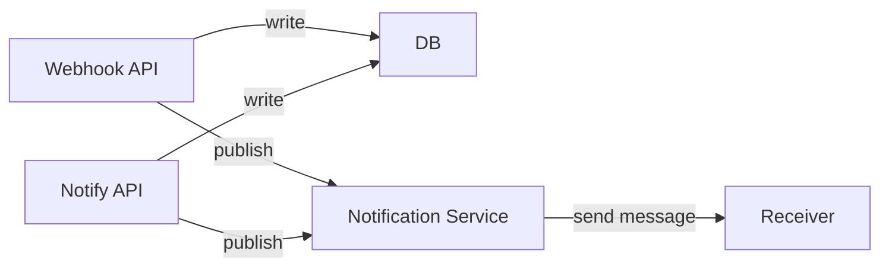

# OIP-002 - Alert Subscription and Notification

Siren is a tool used and developed by the data platform team to manage observability, alerting rules, and notification channels. The alert subscription and notification in Siren is currently handled by the provider (Cortex). This RFC explains how we move the responsibility of alert subscription and notification from the provider to Siren. In current Siren version, the only providert that siren supports is CortexMetrics. In this RFC, we use CortexMetrics or Cortex as the example of provider.

# Background

Based on the [PRD](https://github.com/odpf/platform/discussions/15), these are the expected use cases that users are capable to:

- Create alert policy/rules
- Create SLO/SLI
- Create incident
- Send non-alert notification
- Silence alert
- Subscribe to an alert
- Received notification
- Get alert/policy & subscription changes
- Get an incident

From the use-cases mentioned above, we can summarize the whole flow of the requirements to be like this. To identify what problems to tackle, we could figure out the gap between the flow of our existing system vs the ideal flow.



**Source Signal**

- This is the process where the telemetry signal is being sent to the system.
- _Current state_
  - One of Siren's providers is CortexMetrics. In some setup, Siren uses CortexMetrics backend and upstream services/jobs send metrics with prometheus to the CortexMetrics.
- _Problems_
  - Not much problem for this case. One small problem with this is the scattered responsibility between the provider and Siren. Siren does not have responsibility to consume observability data. The rationale of this decision previously was to not burdening Siren with incoming high traffic.
  - For now, we could keep this behavior and evaluate it.

**Alert Generation & Silencing**

- The incoming signal is being processed and based on a specific alert/policy and threshold, an alert with certain severity will be triggered. In case of there are silences for the alerts, alerts won't be triggered.
- _Current state_
  - We heavily rely on Cortex Alertmanager in this process. Alert generation (trigger) and silencing are being done in Cortex Alertmanager. Siren role is just proxying rules creation to the provider (Cortex Alertmanager). Siren provides templating and rules definition and siren rules are converted to Cortex Alertmanager rules.
  - Siren does not currently have capability to silence alerts. To silence alerts, one could call Cortex Alertmanager API or open Cortex Alertmanager UI and manually add silence there.
- _Problems_
  - Alert generation & silencing are being done on the provider side. Not a real big deal for now, but if we intend to support more providers, some providers might not have the same/similar capabilities.

**Notification Creation Request**

- This is the process of a request to generate a notification.
- Current State
  - Siren is currently having an endpoint `/notify` but that is only designed to send notifications via slack.
- Problems
  - Notify endpoint in siren is highly coupled to slack specific configuration. Siren might need to have abstraction on top of it.

**Send Notification**

- This is the process where a notification is being generated. The notification is then being sent to the subscribed receivers.
- Current State
  - There are two places to generate notification in our system currently. The notification generation for manual trigger handled by siren but the notification generation based on alerts handled by Cortex Alertmanager.
  - Siren supports adding a receiver of notification (only for pagerduty and slack). The receiver could be used for alert subscription. User needs to create a subscription (inside it there are receiver id , receiver configuration, and match labels). Which receiver will be notified, that depends on the alert labels that match with match labels. However these processes of sending notifications to receivers are being done in Cortex Alertmanager.
  - Siren itself has the capability to manually send slack messages to individuals or groups.
- Problems
  - Responsibility to generate notification is not centralized.
  - Cortex Alertmanager supports a limited number of receiver types. Relying on Cortex Alertmanager to generate notifications will block us from supporting more receiver types.
  - Alert subscription does match labels of the subscription vs alerts labels. If there are match labels, notifications will be triggered.

**Incident Creation Request**

- This is the process of a request to generate an incident.
- This won't be covered in this RFC.
- Current State
  - We don't have this feature as of now.

**Incident Generation**

- This is the process of generating incidents. An incident could be generated by manually creating it or converting it from Alert.
- This won't be covered in this RFC.
- Current State
  - We don't have this feature as of now.

## Problems

Below is the existing architecture of Siren. Siren responsibility is only proxying cortex rules and alert config and sending notification directly to slack. Alerts generation, silencing and notifications are being done by CortexMetrics.



To subscribe an alert, user could register a new subscription by calling create subscription API with this data

```go
type Subscription struct {
	ID        uint64            `json:"id"`
	URN       string            `json:"urn"`
	Namespace uint64            `json:"namespace"`
	Receivers []Receiver        `json:"receivers"`
	Match     map[string]string `json:"match"`
	CreatedAt time.Time         `json:"created_at"`
	UpdatedAt time.Time         `json:"updated_at"`
}
```

If labels in the triggered alert match with the match labels in subscriptions, receivers will get notifications.

The problem with the existing Siren architecture are
Users could only subscribe to alerts generated by CortexMetrics
The notification channels (vendors) are limited to what CortexMetrics (provider) supports.

From the requirements, what we want are
Users could subscribe to any alerts or notifications
We have more flexibility to support more notifications channels

Therefore, there is a need to rethink Siren architecture to accommodate the requirements.

# Proposal

As we want to have flexibility to support more notification channels and capability to support subscriptions for generic use cases, there are several possible approaches to solve this.

## Abandoned Ideas

**Proxy-to-provider**



This approach relies on the provider more. Cortex Alertmanager used to consume alerts only from Cortex ruler (the one that generates the alerts). Cortex ruler calls a Cortex Alertmanager's API to trigger notification. We could utilize the API to let Cortex send notification although the source was not coming from the Cortex ruler.

Siren responsibility here is only proxying tasks to the provider. Notification flow is fully owned by the provider. When there is a manual notification triggered, Siren will transform the notification into Cortex Alert and call Alertmanager API.

With this approach, there won't be much changes on subscription flow. Users could still use the existing flow to subscribe to an alert.

- **Pros**
  - Relatively simpler to implement.
- **Cons**
  - Notification channels that are supported will be limited to what provider supports.
  - Some providers might not have a capability to send notifications like Cortex Metrics/Prometheus.

## Preferred Approach

**Notification-as-a-Service**



Cortex Alertmanager won't have responsibility to send notification to external vendors (slack, pager duty). The communication of Alert between Cortex and Siren is only being done through a webhook with this information in the body to `/v1beta1/alerts/cortex/{provider_id}`.

```json
{
  "version": "4",
  "groupKey": <string>,              // key identifying the group of alerts (e.g. to deduplicate)
  "truncatedAlerts": <int>,          // how many alerts have been truncated due to "max_alerts"
  "status": "<resolved|firing>",
  "receiver": <string>,
  "groupLabels": <object>,
  "commonLabels": <object>,
  "commonAnnotations": <object>,
  "externalURL": <string>,           // backlink to the Alertmanager.
  "alerts": [
    {
      "status": "<resolved|firing>",
      "labels": <object>,
      "annotations": <object>,
      "startsAt": "<rfc3339>",
      "endsAt": "<rfc3339>",
      "generatorURL": <string>,      // identifies the entity that caused the alert
      "fingerprint": <string>        // fingerprint to identify the alert
    },
    ...
  ]
}
```

Once an alert in webhook is received in Siren, Siren will forward it to a Notification Service that is responsible to trigger notification and to route the notification to the receivers. Each provider will have a different webhook API.

Although the approach name is `Notification-as-a-service`, it doesn't mean we will create a new different service for it. The notification service could still be in Siren but better to have less logical coupling to all components in siren. Therefore, it is possible for the notification service to be done on a separate RFC.

The flow of notification would be like this:



This approach requires the changes to be backward compatible with our existing siren. Changes that we need are:

1. Create a new webhook API as an entry point for notifications that are only being called by Cortex for the new flow. The webhook `/v1beta1/alerts/cortex/{provider_id}` is still being used for alert history (for backward compatibility).
2. Update `/v1beta1/Notify` (if not being used) as an entry point of a manual trigger notification.
3. Create a new table to store triggered notifications (Not the notifications that we sent to specific channels, this part will be handled by notification service laters). This will store data that is triggered manually via /v1beta1/Notify and via new webhook API.
4. We could introduce a new apiVersion v3 for the rule template to indicate the rules should use new flow (won't trigger notification through alertmanager). Otherwise it is still using the old flow.
   We need to make the receiver part of the notification service and decouple it from the siren main flow.
5. Use subscriptions to wire alerts and notifications. We still could use labels to match labels, from alerts and subscriptions. For manual notifications, we could have a new label called `topic` to subscribe for a specific notification event.

- **Pros**
  - Flexibility to add more notification channels.
  - Decoupling notification from alerting for scalability.
- **Cons**
  - Require more complex development for Notifications service.
