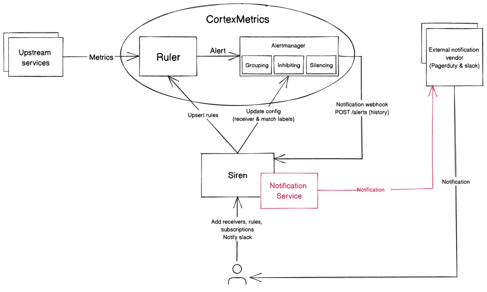
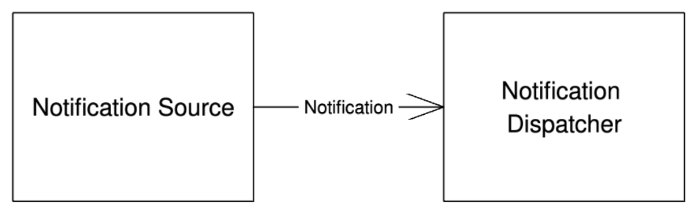

# OIP-003 - Siren as Notification Service

Siren is a tool used and developed by the data platform team to manage observability, alerting rules, and notification channels. The alert subscription and notification in Siren is currently handled by the provider (Cortex). Based on the previous [RFC](./OIP-002-alert-subscription-and-notification.md), we prefer for Siren to handle notification subscription and distribution. This RFC explains the high level of Notification Service that would be implemented.

# Background

**Architecture**

Below is the existing architecture of Siren. Siren responsibility is only proxying cortex rules and alert config and sending notification directly to slack. Alerts generation, silencing and notifications are being done by CortexMetrics.


**Siren Domain Model**


**Subscriptions**

To subscribe to an alert, users could register a new subscription by calling create subscription API with subscription model data mentioned above. The subscription data will be transformed to Alertmanager config and uploaded to Cortex. In Cortex, if labels in the triggered alert match with the match labels in subscriptions, receivers will get notifications.

**Notifications**

Notifications handled by Cortex Alertmanager, the number of supported receivers/notification channels are limited to what Cortex Alertmanager supports now. For siren, currently it supports slack and pagerduty notifications.

**Alert History**

Siren also utilizes Cortex webhook to send alerts notification to siren. Siren provides an API to be a webhook and all alerts are ingested to that webhook. Siren stores the notifications as alert history.

## Requirements

The problem with the existing Siren architecture are:

- Users could only subscribe to alerts generated by CortexMetrics.
- The notification channels (vendors) are limited to what CortexMetrics (provider) supports.

Meanwhile what we want are:

- Users could subscribe to any alerts or notifications.
- We have more flexibility to support more notifications channels.

For the notifications, these are what we expect

- User could subscribe to more than one receivers.
- Each receiver in subscription could have a template.
- Notification request should be idempotent.
- Similar to alert, we could extend notification with notification silencing and grouping/batching feature.

# Proposal

The proposed architecture as part of the previous [RFC](./OIP-002-alert-subscription-and-notification.md) is like this.



This architecture expects Cortex/provider to only send alerts notifications to the siren webhook and the responsibility notification is taken care of by Siren. This RFC focuses on the implementation detail of the Notification Service.

Here are the steps to generate notifications and its responsibility, we will discuss what is the preferred approach for each step.


1. Notification Source

   - Communicate to Notification Dispatcher to publish a notification.

2. Notification Dispatcher

   - Notification Model.
   - Match notification with subscribers.
   - For each subscriber, generate a notification message and publish to queue.
   - Resolve template and transform message to vendor-specific message.

3. Queue

   - Buffer of notification messages to reduce the pressure.

4. Notification Handler

   - Subscribe to queue for a message.
   - Send to the external vendor.

## Notification Source

The current plan, there will be 2 possible sources: **Alert webhook from provider** and **Manually triggered API**. Whatever the source is, the model should be transformed into a single model called `Notification`. There should be idempotency handling in this step. The detail of how idempotency is being implemented will be discussed in another RFC later.

## Notification Dispatcher

Notification dispatcher responsibilities are to generate notification messages to all subscribers. Since it is possible to have multiple receivers for a subscription, for every dispatched notification there will be one or more notification messages generated. Notification dispatcher sends messages asynchronously by publishing messages to a queue. Some decision about dispatcher needs to be discussed:

1. Subscription flow
2. Notification Model
3. Notification Message Model

### Subscription Flow

```go
type Subscription struct {
	ID        uint64            `json:"id"`
	URN       string            `json:"urn"`
	Namespace uint64            `json:"namespace"`
	Receivers []Receiver        `json:"receivers"`
	Match     map[string]string `json:"match"`
	CreatedAt time.Time         `json:"created_at"`
	UpdatedAt time.Time         `json:"updated_at"`
}
```

Above is the details of the subscription model. The existing subscription will match labels to the kv-labels in the alerts. We could still keep this behavior in Siren. To know which subscription that should be notified, Siren could expect kv-labels in Notification model and kv-labels in subscriptions. For each matching, Siren fetches receivers and for each receiver, Siren generates a message.

```go
var n notification.Notification
..
receivers := subscription.GetReceiversByLabels(n.Labels)
for _,rcv := range receivers {
    notificationMessage := n.BuildMessage(rcv)
    notification.Publish(notificationMessage)
}
```

**Consideration**

Need to figure out the best way to filter labels-set in Postgres
Optimization could be done later by caching the match labels index of each subscription in-memory

### Notification Model & Notification Message Model

The Notification Model contains information that should be sent to each receiver. Each receiver could have a specific requirement of a notification payload and we assume it is customizable.
One of the features that we expect in notification is the message templating which will be resolved in Notification Dispatcher. Siren already had a templating feature, we could utilize that feature for this purpose.
type Notification struct {
ID uint64
Variables map[string]string
Labels map[string]string
ExpiryDuration string
CreatedAt time.Time
}

When registering a subscription of a notification, one could add a template key in the receiver. If no template key is found, the default template will be used.

```go
type Subscription struct {
    ...
    Receivers: []receiver.Receiver{
      {
        ID: 1,
        Configurations: map[string]interface{}{
          "channel_name": "odpf-critical",
          "template": "alert-slack-details",
        },
      }
    },
    ...
}
```

Notification Message is a Materialized View of Notification for a specific receiver type (vendor). It has delivery status FAILED/PUBLISHED to track.

```go
type Message struct {
	ID              uint64
	ReceiverType    Receiver
	ReceiverConfigs map[string]interface{}
	Details         map[string]interface{}
      Status          string
      ExpiredAt       time.Time
	CreatedAt       time.Time
	UpdatedAt       time.Time
}
```

The dispatcher converts Notification to Notification Message. If the template in receiver config in subscriber is not empty, the dispatcher will resolve variables with the template and the rendered yaml text will be read to be converted to vendor-specific details struct.


## Dispatch Execution

There are a lot of tasks that the dispatcher is doing. Considering this factore, there are 2 possible approaches to the execution.

### Abandoned Ideas

**Asynchronous**


This approach adds a buffer between notification source and dispatcher. What queue buffer to use will be similar with the queue that is being used in publishing the notification message. That will be discussed in the next section.

- **Pros**
  - Could afford throughput relatively higher than synchronous execution.
- **Cons**
  - More complex interaction.
  - Introduce an additional point of failure (queue).

### Preferred Approach

**Synchronous**

This is the simplest approach. Notification Sources just need to transform their model to a Notification model and call Notification Dispatcher function.



- **Pros**
  - Easier to implement (as simple as calling function).
- **Cons**
  - Considering the relatively heavy tasks that are being done in Notification dispatcher (label matching, template rendering), Notification dispatcher will get more pressure if the rate of incoming notifications is higher than the rate of dispatching notification (e.g. for bulk notifications).

## Message Queue

Considering the notification handler will interact with external parties, the interaction would be less reliable and not as rapid as invoking local functions or interacting within a local network. With this scenario, having a queue to buffer notification messages is needed since a Notification will also be transformed into one-or-multiple Notification Messages. There are a couple approaches possible to implement this message queue.

### Abandoned Ideas

**Message Queue Infrastructure (Kafka, RabbitMQ, etc)**

Although this approach seems trivial to choose, this approach is less preferred since it will add dependency to a new component and could make Siren less vendor-neutral. We might want to make Siren to have a capability to plug any Message Queuing system. But that sure won't be in this scope.

- **Pros**
  - No need to implement logic to queue.
  - Could leverage features provided by the tool.
- **Cons**
  - More infra to manage.

**Redis-based Queue (e.g. gocraft/work)**

There are several tools written in Go that could manage queues like gocraft/work. The tool provides out-of-the-box features that we need. It supports managing dead jobs, scheduling jobs, and retrying the dead jobs.

- **Pros**
  - Out-of-the box features to leverage.
    Has a UI to check the jobs.
- **Cons**
  - More infra to manage.

### Preferred Approach

**PostgreSQL FOR UPDATE / SKIP LOCKED**

We could leverage PostgreSQL to implement a queue with FOR UPDATE & SKIP LOCKED. A notification handler goroutine could be run periodically to fetch the rows and process the messages. With this we are sure that a message is only being picked up by one goroutine. With this approach, we could have a new table like this.

```sql
CREATE TABLE message_queue
(
   id               bigserial NOT NULL,
   status           integer DEFAULT 0 NOT NULL,
   try_count        integer DEFAULT 0 NOT NULL,
   max_tries        integer DEFAULT 5 NOT NULL,
   receiver_type    string NOT NULL,
   receiver_configs jsonb,
   details          jsonb,
   expired_at       timestamptz,
   created_at       timestamptz DEFAULT CURRENT_TIMESTAMP NOT NULL,
   updated_at       timestamptz,
   priority         integer DEFAULT 0 NOT NULL
);
```

status could be 0 if unpublished, -1 if failed, and 1 if published
priority is there just in case we want to have priority-based queue

- **Pros**
  - No additional component (infra) required.
    Relatively easy to implement.
- **Cons**
  - Queue table might be bloated after sometime (need to have periodic maintenance like vacuum or bloated table monitoring).

## Notification Handler

Notification handler responsibilities is to send notification messages outbond. It should have knowledge about all external notification vendors' contracts. Notification handler consumes notification message and transforms it to vendor-specific message. To support at-least-once delivery, there is a need to have retry logic in notification handler (probably with exponential backoff) or a need to store dead messages in DLQ and retry them.

For each notification message, the validity would depend on the `expired_at` field. The empty or null `expired_at` field would indicate the message won't be expired. When the failed-to-send notification message is being retried, the notification messages that exceed the validity won't be retried.

The existing siren pre-define slack and pagerduty receivers details in an alertmanager config template file. For notification service approach, we will only keep webhook config for alertmanager and extract out slack and pagerduty templates. Each receiver type will expect a specific contract of notification and users could configure the contract with a yaml file generated by template if needed. For example, slack details yaml is possible to contain all supported slack chat.PostMessage payload. Notification templates always have a receiver_type key to be used for validation.

```yaml
apiVersion: v2
type: template
name: alert-slack-details
body:
  receiver_type: slack
  attachments:
    - text: '[[.text]]'
      icon_emoji: ':eagle:'
      link_names: false
      color: '[[.color]]'
      title: '[[.title]]'
      pretext: '[[.pretext]]'
      text: '[[.text]]'
      actions:
        - type: button
          text: 'Runbook :books:'
          url: '[[.runbook"]]'
        - type: button
          text: 'Dashboard :bar_chart:'
          url: '[[.dashboard"]]'
variables:
  - name: color
    type: string
    description: slack color
    default: #2eb886
  - name: text
    type: string
    default: This is an alert
  - name: title
    type: string
    default: Alert
  - name: pretext
    type: string
    description: Pre-text of slack alert
    default: Siren
  - name: runbook
    type: string
    description: url to runbook
    default: http://url
  - name: dashboard
    type: string
    description: url to dashboard
    default: http://url
tags:
  - slack
```
